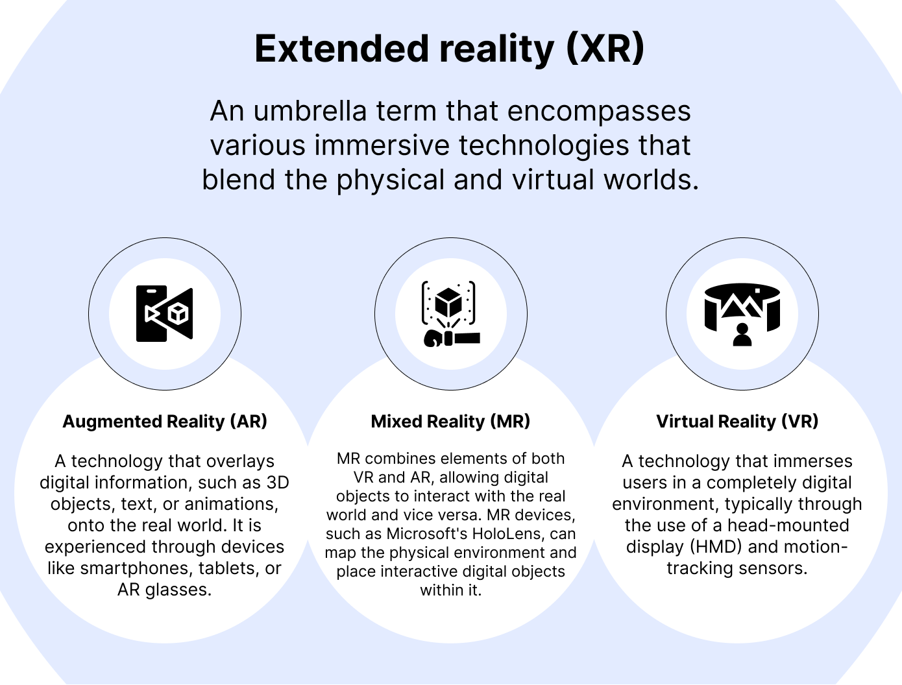

# World tracking on Web with WebXR

This is a demo implementation of [WebXR Device API](https://github.com/immersive-web/webxr/tree/master). Purpose of this project is to showcase how we can develop XR application for web browsers using WebXR. This project showcases implementation of Hit-test to find out vertical and horizontal plains and initiate 3D geometry.

## [Click to watch demo](./assets/WebAR_Spatial.mp4)

https://raw.githubusercontent.com/siddheshgunjal/html_surface_tracking/main/assets/WebAR_Spatial.mp4

## [Click to try it yourself](https://siddheshgunjal.github.io/html_surface_tracking/)

# Table of contents

* [What is Extented Reality?](#what-is-extended-reality)

* [What is WebXR](#what-is-webxr)

* [How to run this Project on your local machine](#how-to-run-this-project-on-your-local-machine)

* [How to use your 3D model](#how-to-use-your-3d-model)
  
  * [Prerequisite](#prerequisite)
  
  * [changes in app.js](#changes-in-appjs)
  
  * [changes in libs/Player.js](#changes-in-libsplayerjs)

* [Objectives](#objectives)

* [Support](#support-sparkles)

* [Maintainer](#maintainer-sunglasses)

## What is Extended Reality

Extended reality (XR) is an umbrella term to refer to [Augmented reality](https://en.wikipedia.org/wiki/Augmented_reality) (AR), [Virtual reality](https://en.wikipedia.org/wiki/Virtual_reality) (VR), and [Mixed reality](https://en.wikipedia.org/wiki/Mixed_reality) (MR). The technology is intended to combine or mirror the physical world with a "digital twin world" able to interact with it, giving users an immersive experience by being in a virtual or augmented environment.

XR is not limited to just these three categories and can emcompass other technologies and variations as well. The key concept behind XR is the blending of physical and digital experiences to create immersive and interactive environments. XR has applications in various industries, including gaming, education, helathcare, architecture, engineering and entertainment.

## What is WebXR

WebXR is an API for web content and apps to use to interface with mixed reality hardware such as VR headsets and glasses with integrated augmented reality features. This includes both managing the process of rendering the views needed to simulate the 3D experience and the ability to sense the movement of the headset (or other motion-sensing gear) and provide the needed data to update the imagery shown to the user.

WebXR additionally provides support for accepting inputs from control devices such as handheld VR controllers or specialized mixed reality gamepads.

_WebXR is not a rendering technology and does not provide features for managing 3D data or rendering it to the display._ This is an important fact to keep in mind. While WebXR manages the timing, scheduling, and the various points of view relevant when drawing the scene, it does _not_ know how to load and manage models, nor how to render and texture them, and so forth. That part is entirely up to you. Fortunately, WebGL and the various WebGL-based frameworks and libraries are available to make it much easier to deal with all of that.

## How to run this Project on your local machine

In order to run the WebXR Device API we need `https`. To the test/debug WebXR applications, the simplest method is to host your local server over https over [ngrok](https://ngrok.com/). Follow below steps to run this project:

Clone this repo
     git clone https://github.com/siddheshgunjal/html_surface_tracking.git

Go into the repo
     cd html_surface_tracking

Run app in local server using any means (I chose python)
     python -m http.server 4345

Host your local server over https using `ngrok`
     ngrok http 4345

Now visit the `https` url from your hand-held device

## How to use your 3D model

### Prerequisite

You'll need 3D model in `.glb` [format][glb-format]

### changes in app.js

- Put your 3D model into `./assets` folder.

- `line 110`: change the name of your 3D model

- `line 117-line 127`: change the default settings of your model like default animation clips, animation speed, etc.

- `line 133`: scale of your 3D model.

- `line 207-line 211`: animations to trigger for respective gestures.

### changes in libs/Player.js

- `line 106`: change walking animation clip name.

- `line 155` & `line 185`: change default animation clip name.

## Objectives

- [x] Detect if XR capabilities are available

- [x] Query the XR device capabilities

- [x] Scan and detect nearby vertical and horizontal planes

- [x] Spawn 3D object on the detected surface

- [x] Control the 3D object with Gestures

- [x] Relocate 3D model with animation withing same `XRSession`

# Support :sparkles:

If you get stuck, we’re here to help. The following are the best ways to get assistance working through your issue:

* Use our [Github Issue Tracker][gh-issues] for reporting bugs or requesting features.
  Contribution are the best way to keep thos project amazing :muscle:

# Maintainer :sunglasses:

[][portfolio]

<!-- Markdown link -->

[gh-issues]: https://github.com/siddheshgunjal/html_surface_tracking/issues

[portfolio]: https://siddheshgunjal.github.io

[glb-format]: https://docs.fileformat.com/3d/glb/
